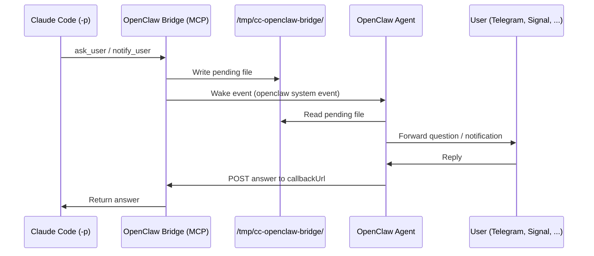

[](LICENSE)

# OpenClaw Bridge

An MCP server that gives [Claude Code](https://docs.anthropic.com/en/docs/claude-code) a voice when running headless. Questions and notifications are delivered through [OpenClaw](https://openclaw.ai) to the user's messaging app — Telegram, Signal, Discord, or anything else connected — and answers flow back in real time.

```
claude -p "refactor the auth module" \
  # Claude Code hits a decision point → asks via OpenClaw → user replies on Telegram → work continues
```

## Architecture



## Quick Start

```bash
git clone https://github.com/totorospirit/cc-openclaw-bridge.git
cd cc-openclaw-bridge
./install.sh
```

`install.sh` registers the MCP server with Claude Code and appends usage instructions to `~/.claude/CLAUDE.md`. If cloned to a temporary directory, it auto-copies to `~/.local/share/cc-openclaw-bridge/`.

If running inside an OpenClaw container, also run:

```bash
node setup-env.mjs
```

## Tools Reference

### `ask_user`

Ask 1-4 questions in a single call. Each question supports a short header tag, 2-4 options with descriptions, free-text input, and multi-select.

```json
{
  "questions": [
    {
      "question": "Which auth method?",
      "header": "Auth",
      "options": [
        { "label": "JWT", "description": "Stateless, scalable" },
        { "label": "Sessions", "description": "Server-side, simple" }
      ]
    },
    {
      "question": "What should the service be called?",
      "header": "Name"
    }
  ],
  "context": "setting up the backend"
}
```

### `notify_user`

One-way notification. No reply expected.

```json
{
  "message": "Tests passing, creating PR...",
  "context": "CI/CD"
}
```

### Auto-summary

When Claude Code exits, the bridge writes a session summary — questions asked, answers received, notifications sent — so the OpenClaw agent can forward a completion report.

## Agent Configuration

Add the following to your OpenClaw agent's `AGENTS.md` or `HEARTBEAT.md`:

```
Check /tmp/cc-openclaw-bridge/ for pending files:
- ask-*.json  — forward questions to user, POST answers to callbackUrl
- notify-*.json — forward to user
- summary-*.json — forward completion summary
```

**Answer format:**

| Scenario | Payload |
|---|---|
| Single question | `POST {"answer": "JWT"}` |
| Batch (multiple questions) | `POST {"answers": [{"answer": "JWT"}, {"answer": "React"}]}` |

Present multi-question batches as a single message or deliver them sequentially — whatever suits your messaging surface.

## Multi-agent

Multiple Claude Code instances can run simultaneously. Each question gets a unique pending file and its own HTTP callback server. The OpenClaw agent groups them when presenting to the user.

For richer context in multi-agent setups, export these environment variables before launching Claude Code:

```bash
export CC_WORKDIR="$PWD"
export CC_TASK="fix auth bug"
export CC_ID="cc-$$"
```

## Configuration

| Variable | Default | Description |
|---|---|---|
| `OPENCLAW_BRIDGE_IPC_DIR` | `/tmp/cc-openclaw-bridge` | Pending file directory |
| `OPENCLAW_BRIDGE_TIMEOUT_MS` | `300000` | Answer timeout (5 min) |
| `OPENCLAW_BRIDGE_HOST` | `127.0.0.1` | Callback server bind address |
| `CC_WORKDIR` | cwd | Project directory for context |
| `CC_TASK` | — | Task description for context |
| `CC_ID` | `cc-<pid>` | Instance identifier |

## License

MIT
